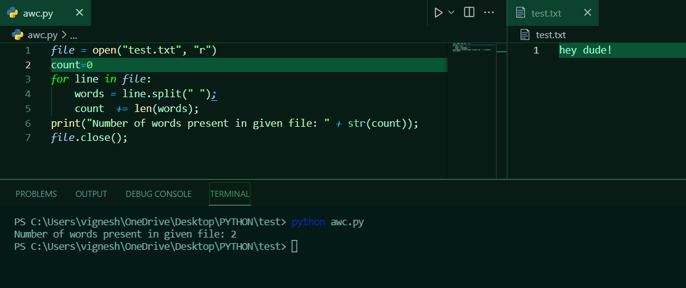

# command-line-arguments-to-count-word
## AIM:
To write a python program for getting the word count from the contents of a file using command line arguments.
## EQUIPEMENT'S REQUIRED: 
PC
Anaconda - Python 3.7
## ALGORITHM: 
### Step 1:
Give file name to read
### Step 2: 
 Now read the content in the file
### Step 3: 
use split()
### Step 4:  
Now read the no.of words in file 
### Step 5: 
Print number of words present in given file
### Step 6: 
End of the program
## PROGRAM:
~~~
''' 
python program for getting the word count from the contents of a file using command line
Developed by: M VIGNESH
RegisterNumber: 21004061
'''
file = open("test.txt", "r") 
count=0 
for line in file:    
    words = line.split(" ");
    count  += len(words);  
print("Number of words present in given file: " + str(count));  
file.close();  
~~~

### OUTPUT:

## RESULT:
Thus the program is written to find the word count from the contents of a file using command line arguments.
